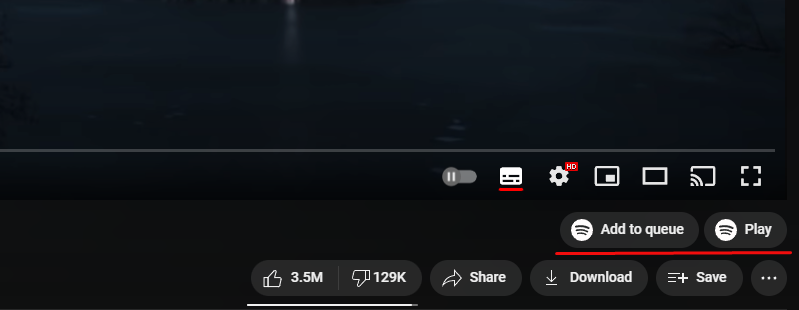

# YouTube to Spotify
Chrome extension to quickly play YouTube songs on Spotify

## Screenshots

## Installation
1. Clone this repo
2. [Load the extension](https://developer.chrome.com/docs/extensions/mv3/getstarted/development-basics/#load-unpacked)

## TODO
- [ ] better authorization flow (refresh token without opening new tab)
- [ ] show toast after playing/adding to queue
- [ ] better song name extraction